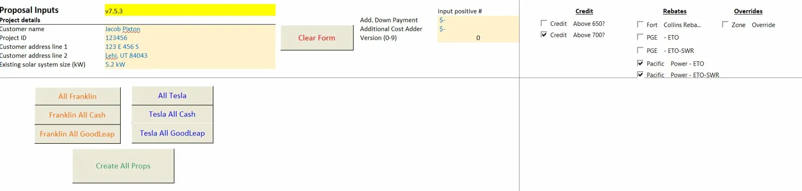
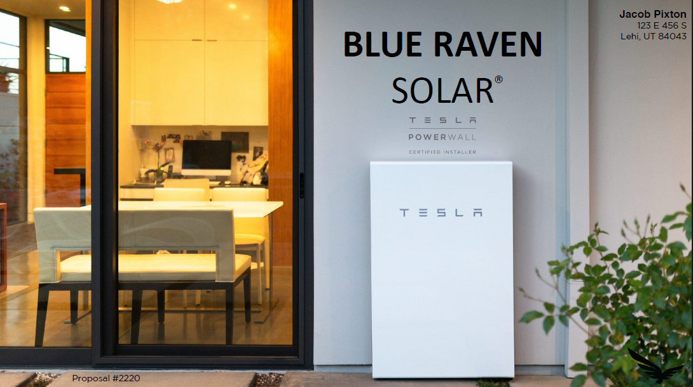
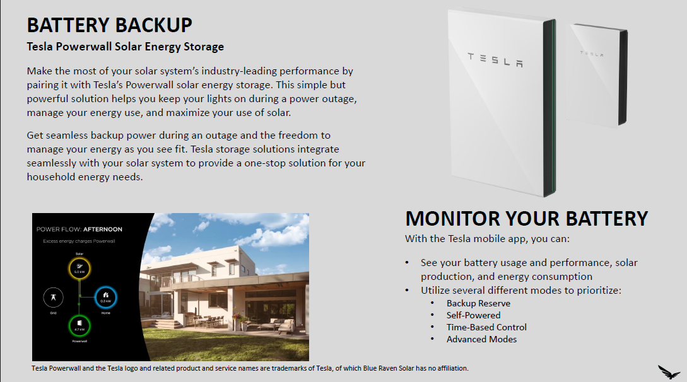
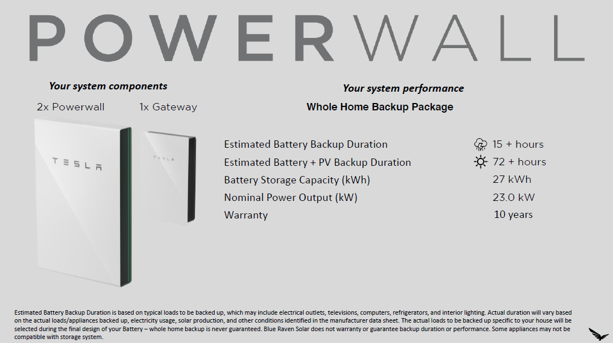
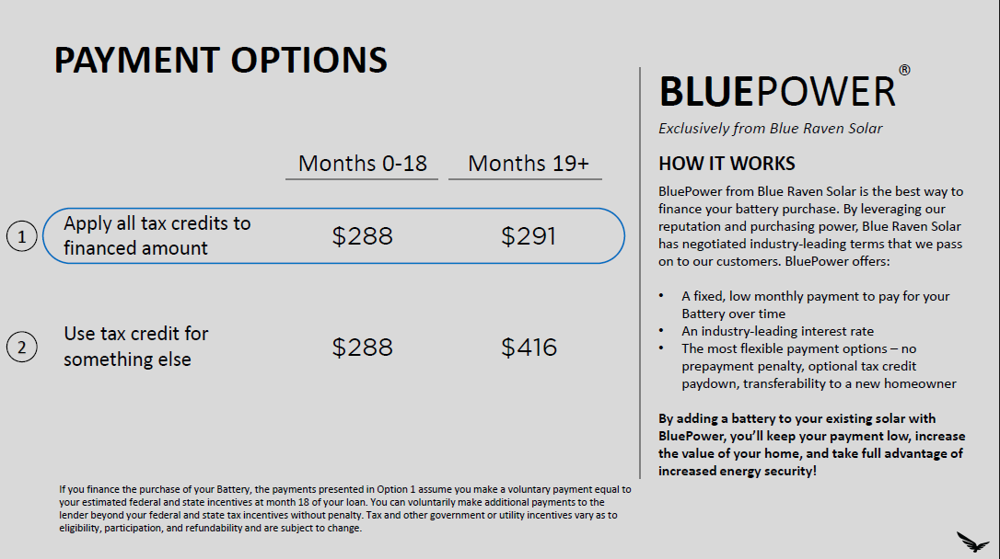
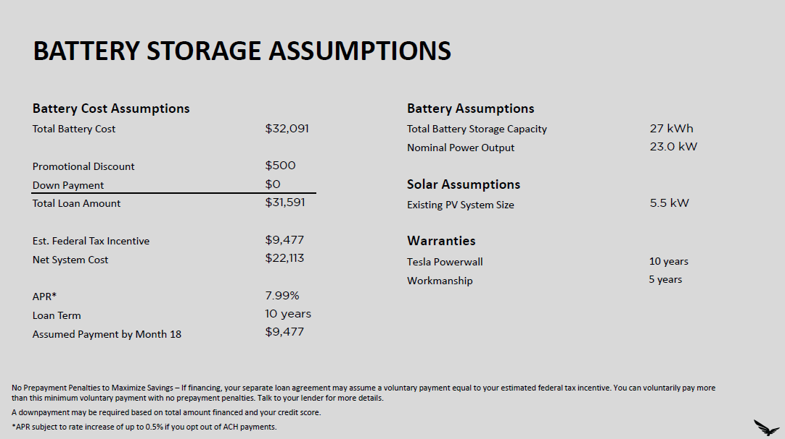

# Battery Retrofit Proposal Tool
**Internal sales automation tool — Blue Raven Solar (v7.5.3)**

---

Battery retrofit proposals used to be a two-team problem. A sales rep would sit with an interested customer, take down their info, and then wait — sometimes hours, sometimes longer — for a back-office team to manually build a pricing proposal and email it back. By then, the momentum was gone.

This tool killed that dependency. A sales rep fills in five fields, clicks a button, and has a polished, fully-calculated, print-ready PDF proposal in seconds. No back-office. No waiting. No dropped deals.

---

## What it does

The tool is an Excel workbook backed by a Python pipeline. The workbook handles all the financial logic — loan payments, tax credit estimates, rebate eligibility, promotional discounts — across a range of battery products and financing structures. When the rep clicks a generate button, VBA hands off to Python, which reads the calculated outputs from a hidden sheet, merges them onto a branded PDF template, and writes the finished proposal to an output folder.

The output is a five-page customer-facing proposal with the customer's name, address, system specs, payment scenarios, and full cost breakdown — all populated automatically, all formatted to match the company's brand standards exactly.


*The full input surface: five data fields, a handful of checkboxes, and a generate button.*

---

## The proposal output


*Page 1 — Branded cover with customer name, address, and proposal number dynamically overlaid.*


*Page 2 — Product overview page, static content from the template.*


*Page 3 — System specs: backup duration, storage capacity, power output, and warranty, all pulled from the workbook.*


*Page 4 — Two payment scenarios (apply tax credit vs. keep it), with month 0–18 and month 19+ breakdowns.*


*Page 5 — Full cost assumptions: total price, discounts, rebates, loan amount, APR, tax credit, and net cost.*

---

## How the code works

The architecture is deliberately split: Excel owns the math, Python owns the presentation.

The workbook contains all the pricing logic across several internal sheets. A dedicated output sheet exposes the final calculated values — payment amounts, tax credits, rebate flags, system specs — in a fixed cell range. Python reads those cells via `openpyxl`, formats them into a dictionary, and passes them to the print function. Nothing about the financial formulas lives in Python, which means the finance team could update rates, rebates, or pricing tiers in the workbook without touching a single line of code.

The PDF side works as a template overlay. Rather than generating proposals from scratch (which would mean replicating complex graphic design in code), the tool copies a pre-built branded PDF template and uses ReportLab to render a transparent canvas layer containing all the customer-specific text. PyPDF2 then merges that overlay onto the template page by page. Each page in the print function only renders what's relevant to that page, so the logic stays clean and easy to extend.

A few details worth pointing out:

- **Custom font rendering.** The proposals use the company's actual brand fonts — Gotham Book, Calibri, Helvetica variants — registered with ReportLab's font metrics at startup. The output is pixel-identical to what the design team would have produced manually.
- **Dynamic right-alignment.** Customer names and addresses are right-aligned to a fixed margin regardless of length. The code calculates string width per font and size, then adjusts the x-coordinate accordingly — no text ever runs off the edge or sits in the wrong spot.
- **Rebate handling.** A flag cell in the rebate sheet controls whether a rebate line appears in the proposal. If it's set, the label and dollar amount render; if not, those fields are blank. The layout stays consistent either way.
- **Self-installing dependencies.** `A_RUN_THIS_FIRST.py` installs all required packages (`openpyxl`, `PyPDF2`, `reportlab`, `requests`) using try/except guards — only installing what's missing. Sales reps with no technical background could get the tool running without touching a command line.
- **Version-aware file discovery.** The tool scans its own directory for a file matching both "MAIN" and the current version string, so it always loads the right workbook without hardcoded paths that break when files get renamed or updated.

---

## Supported proposal types

| Battery | Financing | 
|---|---|
| Tesla Powerwall | GoodLeap (10-year loan) |
| Tesla Powerwall | Cash |
| FranklinWH | GoodLeap (10-year loan) |
| FranklinWH | Cash |

Combo buttons on the main sheet ("All Tesla", "All Franklin", "Create All Props") generate every applicable variant in one click.

---

## Tech stack

| | |
|---|---|
| UI + financial engine | Microsoft Excel with VBA button triggers |
| Workbook data extraction | `openpyxl` |
| PDF template management | `PyPDF2` |
| PDF rendering + overlay | `ReportLab` |
| Language | Python 3 |
| Setup | Self-installing via `A_RUN_THIS_FIRST.py` |

---

## File layout

```
BRS_battery_proposal_tool_v7.5.3/
├── Battery_Retrofit_Prop_Tool_v7.5.3MAIN.xlsm
├── A_RUN_THIS_FIRST.py
├── proposal_scripts/
│   ├── all_proposal_standard_info.py       ← shared paths, fonts, customer info
│   ├── tesla_2_goodleap.py                 ← orchestrator
│   ├── tesla_2_goodleap_prop_data.py       ← reads Excel outputs
│   ├── print_tesla_goodleap_to_pdf.py      ← PDF generation
│   └── [parallel scripts per variant]
├── templates_folder/
│   ├── Tesla Battery Proposal_GL_v6.1.pdf
│   ├── Tesla Battery Proposal_Cash_v6.1.pdf
│   ├── FranklinWH Battery Proposal_GL_v6.1.pdf
│   ├── FranklinWH Battery Proposal_Cash_v6.1.pdf
│   └── [brand font .ttf files]
├── finished_proposals/
│   └── [Customer Name] - #[Proposal #] - [kWh] - [Financing].pdf
└── docs/
    └── [screenshots]
```

---

*Template PDFs, font files, and the Excel workbook are proprietary and not included in this repository. The sample proposal shown uses placeholder customer data.*
